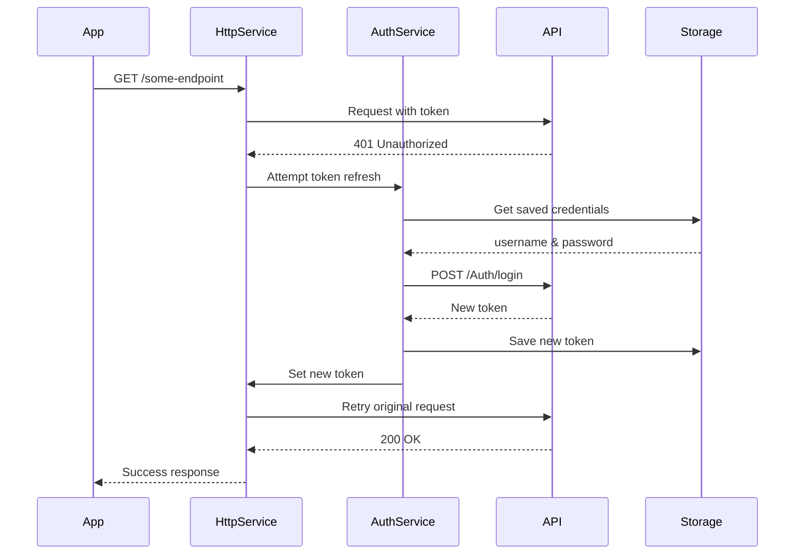

## Overview

LogiScan communicates with a RESTful backend API for all data operations. The integration is built on top of the `HttpService`, which provides a consistent interface for all API calls with built-in error handling, authentication, and automatic token refresh.

## API Configuration

### Environment Setup

The API configuration is centralized in `ApiConfig`:

```dart api_config.dart
class ApiConfig {
  /// Time before expiration to refresh the token (30 minutes)
  static const refreshTokenBeforeExpiry = Duration(minutes: 30);

  /// Interval to check token status (15 minutes)
  static const tokenCheckInterval = Duration(minutes: 15);

  /// Development API URL
  static const String devBaseUrl = 'http://100.104.120.121:82';

  /// Production API URL
  static const String prodBaseUrl = 'https://beehive.gbilogistics.net';

  /// Development mode (change to false for production)
  static const bool isDevelopment = false;

  /// Active base URL (selected based on mode)
  static String get baseUrl => isDevelopment ? devBaseUrl : prodBaseUrl;

  /// API version
  static const String version = '1.0';

  /// Base path for all API endpoints
  static String get apiPath => '/api/mobile/v$version';

  /// Build a complete URL for an endpoint
  static String buildUrl(String endpoint) {
    return '$apiPath$endpoint';
  }
}
```

<Warning>
Ensure `isDevelopment` is set to `false` before building for production. This flag determines which API server the app connects to.
</Warning>

### API Endpoints

All endpoints are defined in a single class for easy maintenance:

```dart api_config.dart
class ApiEndpoints {
  // Authentication
  static String get auth => ApiConfig.buildUrl('/Auth');
  static String get login => ApiConfig.buildUrl('/Auth/login');
  static String get refreshToken => ApiConfig.buildUrl('/Auth/refresh-token');

  // Measurement / AI endpoints
  static String get processMeasurement =>
      ApiConfig.buildUrl('/ProcessPackage/process-measurement-data');
  static String get registerPackage =>
      ApiConfig.buildUrl('/ProcessPackage/register-package');
  static String get uploadPackageImageWithoutId =>
      ApiConfig.buildUrl('/ProcessPackage/upload-package-image-without-id');
  static String get getPackageOwnerByImage =>
      ApiConfig.buildUrl('/ProcessPackage/get-package-owner-by-image');

  // Tracking verification
  static String get verifyTrackingNumber =>
      ApiConfig.buildUrl('/Tracking/verify-tracking-number');
  static String get getPackageTrackingDetails =>
      ApiConfig.buildUrl('/Tracking/get-package-tracking-details');

  // Package images management
  static String get registerPackageImages =>
      ApiConfig.buildUrl('/Tracking/register-package-images');
  static String get deleteTrackingImages =>
      ApiConfig.buildUrl('/Tracking/delete-tracking-images');
}
```

<Tabs>
  <Tab title="Production">
    ```
    Base URL: https://beehive.gbilogistics.net
    Full endpoint: https://beehive.gbilogistics.net/api/mobile/v1.0/Auth/login
    ```
  </Tab>
  <Tab title="Development">
    ```
    Base URL: http://100.104.120.121:82
    Full endpoint: http://100.104.120.121:82/api/mobile/v1.0/Auth/login
    ```
  </Tab>
</Tabs>

## Request/Response Structure

### Standard API Response Format

All API responses follow a consistent structure:

```json
{
  "code": 0,
  "message": "Success message",
  "messageDetail": "Detailed information",
  "content": {
    // Response data
  }
}
```

### ApiResponse Wrapper

Responses are wrapped in a generic `ApiResponse<T>` class:

```dart api_response.dart
class ApiResponse<T> {
  final bool isSuccessful;
  final String? message;        // Success message
  final String? messageDetail;  // Error detail message
  final T? content;

  const ApiResponse({
    required this.isSuccessful,
    this.message,
    this.messageDetail,
    this.content,
  });

  factory ApiResponse.error({
    String? messageDetail,
    T? content,
  }) {
    return ApiResponse(
      isSuccessful: false,
      messageDetail: messageDetail,
      content: content,
    );
  }

  factory ApiResponse.success({
    String? message,
    T? content,
  }) {
    return ApiResponse(
      isSuccessful: true,
      message: message,
      content: content,
    );
  }

  String? get displayMessage => isSuccessful ? message : messageDetail;
}
```

## Error Handling

### Error Codes

The API uses specific error codes to categorize failures:

```dart api_error.dart
class ApiErrorCode {
  // Authentication errors (1-99)
  static const int sessionExpired = 1;
  static const int invalidToken = 2;
  static const int invalidCredentials = 3;

  // State errors (60-69)
  static const int invalidStateForOperation = 60;

  // Validation errors (100-199)
  static const int invalidInput = 100;
  static const int invalidState = 101;
  static const int duplicateEntry = 102;

  // Business errors (200-299)
  static const int guideNotFound = 200;
  static const int invalidGuideState = 201;
  static const int cubeNotFound = 202;
  static const int invalidCubeState = 203;
  static const int invalidOperation = 204;

  // Network errors (400-499)
  static const int networkError = 400;
  static const int timeout = 408;
  static const int unknown = 499;

  // Server errors (500+)
  static const int serverError = 500;
  static const int serviceUnavailable = 503;
}
```

### ApiError Model

```dart api_error.dart
class ApiError implements Exception {
  final int code;
  final String message;
  final Map<String, dynamic>? details;

  const ApiError({
    required this.code,
    required this.message,
    this.details,
  });

  bool get isAuthError => code >= 1 && code < 10;
  bool get isValidationError => code >= 100 && code < 200;
  bool get isBusinessError => code >= 200 && code < 500;
  bool get isServerError => code >= 500;

  String get userMessage => message;

  bool get isRetryable => 
      isServerError || code == ApiErrorCode.serviceUnavailable;

  bool get requiresLogout =>
      code == ApiErrorCode.sessionExpired || 
      code == ApiErrorCode.invalidToken;
}
```

### Error Handling in HttpService

The `HttpService` handles various error scenarios automatically:

<AccordionGroup>
  <Accordion title="401 Unauthorized - Token Refresh">
    ```dart http_service.dart
    if (response.statusCode == 401) {
      if (!_isHandlingExpiredSession && !suppressAuthHandling) {
        final refreshed = await _attemptTokenRefresh();
        if (refreshed) {
          // Retry the original request with new token
          return await get<T>(
            path,
            fromJson,
            queryParams: queryParams,
            suppressAuthHandling: true,
          );
        }
      }

      await _handleSessionExpired(
        suppressAuthHandling: suppressAuthHandling,
        messageDetail: refreshedMessageDetail,
      );
    }
    ```
    
    When a 401 is received, the service automatically attempts to refresh the token and retry the request.
  </Accordion>
  
  <Accordion title="503/501 Server Errors">
    ```dart http_service.dart
    if (response.statusCode == 503 || response.statusCode == 501) {
      return ApiResponse.error(
        messageDetail: 'Ocurrió un error en el servidor',
        content: null,
      );
    }
    ```
    
    Server errors are converted to user-friendly error messages.
  </Accordion>
  
  <Accordion title="Timeout Errors">
    ```dart http_service.dart
    final response = await client
        .get(uri, headers: _headers)
        .timeout(const Duration(seconds: 30));
    ```
    
    All requests have a 30-second timeout. Timeout exceptions are caught and converted to appropriate error responses.
  </Accordion>
  
  <Accordion title="Network Errors">
    ```dart http_service.dart
    } catch (e) {
      AppLogger.error('Error en GET request', error: e, source: 'HttpService');
      final error = ApiError(
        code: e is TimeoutException
            ? ApiErrorCode.timeout
            : ApiErrorCode.networkError,
        message: e.toString(),
      );
      return ApiResponse.error(messageDetail: error.userMessage);
    }
    ```
    
    Network failures are caught and presented as user-friendly error messages.
  </Accordion>
</AccordionGroup>

## Authentication Flow

### Login Request

```dart auth_service.dart
Future<ApiResponse<LoginResponse>> login(LoginRequest request) async {
  try {
    final response = await _http.post<LoginResponse>(
      ApiEndpoints.login,
      request.toJson(),
      (json) => LoginResponse.fromJson(json),
    );

    if (response.isSuccessful && response.content?.token != null) {
      final token = response.content!.token!;
      final loginData = response.content!;
      _http.setToken(token);
      await _storage.setToken(token);
      await _storage.setLoginData(loginData.toJson());
    }

    return response;
  } catch (_) {
    return ApiResponse.error(
      messageDetail: null,
      content: LoginResponse.empty(),
    );
  }
}
```

### Authenticated Requests

Once authenticated, all requests automatically include the token:

```dart http_service.dart
Map<String, String> get _headers => {
  'Content-Type': 'application/json',
  'Accept': 'application/json',
  if (_token != null) 'Authorization': _token!,
  ...VersionService.instance.versionHeaders,
};
```

### Token Refresh Mechanism



## Making API Calls

### GET Request Example

```dart measurement_service.dart
Future<ApiResponse<GetPackageTrackingDetailsResponse>>
    getPackageTrackingDetails(String trackingNumber) async {
  try {
    final response = await _http.get<GetPackageTrackingDetailsResponse>(
      ApiEndpoints.getPackageTrackingDetails,
      (json) => GetPackageTrackingDetailsResponse.fromJson(json),
      queryParams: {
        'identifier': trackingNumber,
      },
    );

    if (!response.isSuccessful) {
      return ApiResponse.error(
        messageDetail: response.messageDetail,
        content: const GetPackageTrackingDetailsResponse.empty(),
      );
    }

    return response;
  } catch (_) {
    return ApiResponse.error(
      messageDetail: null,
      content: const GetPackageTrackingDetailsResponse.empty(),
    );
  }
}
```

### POST Request Example

```dart measurement_service.dart
Future<ApiResponse<ProcessMeasurementDataResponse>>
    processMeasurementData(ProcessMeasurementDataRequest request) async {
  try {
    final response = await _http.post<ProcessMeasurementDataResponse>(
      ApiEndpoints.processMeasurement,
      request.toJson(),
      (json) => ProcessMeasurementDataResponse.fromJson(json),
    );

    if (!response.isSuccessful) {
      return ApiResponse.error(
        messageDetail: response.messageDetail,
        content: ProcessMeasurementDataResponse.empty(),
      );
    }

    return response;
  } catch (_) {
    return ApiResponse.error(
      messageDetail: null,
      content: ProcessMeasurementDataResponse.empty(),
    );
  }
}
```

### DELETE Request Example

```dart measurement_service.dart
Future<ApiResponse<GenericOperationResponse>> deleteTrackingPackageImages(
  DeleteTrackingPackageImagesRequest request,
) async {
  try {
    final response = await _http.delete<GenericOperationResponse>(
      ApiEndpoints.deleteTrackingImages,
      request.toJson(),
      (json) => GenericOperationResponse.fromJson(json),
    );

    if (!response.isSuccessful) {
      return ApiResponse.error(
        messageDetail: response.messageDetail,
        content: const GenericOperationResponse(userMessage: null),
      );
    }

    return response;
  } catch (_) {
    return ApiResponse.error(
      messageDetail: null,
      content: const GenericOperationResponse(userMessage: null),
    );
  }
}
```

## Request Headers

### Standard Headers

Every request includes:

```dart
'Content-Type': 'application/json'
'Accept': 'application/json'
'Authorization': 'Bearer <token>'
```

### Version Headers

Automatic version tracking for analytics and compatibility:

```dart version_service.dart
Map<String, String> get versionHeaders => {
  'X-App-Version': version,      // e.g., "1.0.0.8"
  'X-App-Build': buildNumber,    // e.g., "8"
  'X-App-Platform': platform,    // e.g., "android"
  'X-Client-Type': 'mobile-app',
};
```

### Version Check Response

The backend can include version update headers in responses:

```dart version_service.dart
class VersionResponse {
  final bool updateRequired;
  final bool updateAvailable;
  final String? minVersion;
  final String? latestVersion;
  final String? updateMessage;
  final String? updateUrl;

  factory VersionResponse.fromHeaders(Map<String, String> headers) {
    return VersionResponse(
      updateRequired: headers['X-Update-Required']?.toLowerCase() == 'true',
      updateAvailable: headers['X-Update-Available']?.toLowerCase() == 'true',
      minVersion: headers['X-Min-Version'],
      latestVersion: headers['X-Latest-Version'],
      updateMessage: headers['X-Update-Message'],
      updateUrl: headers['X-Update-URL'],
    );
  }
}
```

## Logging and Debugging

### Request Logging

```dart http_service.dart
AppLogger.log('GET $uri Params: $queryParams', source: 'HttpService');
AppLogger.apiCall(uri.toString(), method: 'GET');
```

### Response Logging

```dart http_service.dart
AppLogger.apiResponse(
  uri.toString(),
  statusCode: response.statusCode,
  body: sanitizedBody,
);
```

### Example Log Output

```
----------------------------------------
[INFO] [HttpService]: GET https://beehive.gbilogistics.net/api/mobile/v1.0/Tracking/get-package-tracking-details?identifier=ABC123 Params: {identifier: ABC123}
----------------------------------------
[INFO] [API]: API Call: GET https://beehive.gbilogistics.net/api/mobile/v1.0/Tracking/get-package-tracking-details?identifier=ABC123
----------------------------------------
[INFO] [API]: API Response: https://beehive.gbilogistics.net/api/mobile/v1.0/Tracking/get-package-tracking-details?identifier=ABC123
Status: 200
Body: {"code":0,"message":"Success","content":{...}}
----------------------------------------
```

## Retry Logic

### Automatic Retry on Token Refresh

When a 401 is encountered, the request is automatically retried once after refreshing the token:

```dart http_service.dart
if (response.statusCode == 401) {
  if (!_isHandlingExpiredSession && !suppressAuthHandling) {
    final refreshed = await _attemptTokenRefresh();
    if (refreshed) {
      // Retry the original request
      return await get<T>(
        path,
        fromJson,
        queryParams: queryParams,
        suppressAuthHandling: true,  // Prevent infinite retry loop
      );
    }
  }
}
```

<Note>
The `suppressAuthHandling` parameter prevents infinite retry loops by ensuring the retry doesn't trigger another token refresh attempt.
</Note>

### No Automatic Retry for Other Errors

For non-authentication errors, the app doesn't automatically retry. Instead, it returns an error response and lets the UI or service layer decide how to handle it.

## Best Practices

<AccordionGroup>
  <Accordion title="Always Use ApiResponse Wrapper">
    Wrap all API calls in try-catch and return `ApiResponse.error()` on failure:
    
    ```dart
    try {
      final response = await _http.post(...);
      if (!response.isSuccessful) {
        return ApiResponse.error(
          messageDetail: response.messageDetail,
          content: EmptyResponse(),
        );
      }
      return response;
    } catch (_) {
      return ApiResponse.error(
        messageDetail: null,
        content: EmptyResponse(),
      );
    }
    ```
  </Accordion>
  
  <Accordion title="Provide Empty/Default Content">
    Always provide a default content object in error responses to avoid null checks:
    
    ```dart
    return ApiResponse.error(
      messageDetail: 'Error occurred',
      content: MyResponse.empty(),  // Not null
    );
    ```
  </Accordion>
  
  <Accordion title="Use Type-Safe Endpoints">
    Define all endpoints as static getters in `ApiEndpoints` rather than hardcoding strings:
    
    ```dart
    // Good
    await _http.get(ApiEndpoints.getPackageTrackingDetails, ...);
    
    // Bad
    await _http.get('/Tracking/get-package-tracking-details', ...);
    ```
  </Accordion>
  
  <Accordion title="Log All API Calls">
    Use `AppLogger` for consistent logging across the app:
    
    ```dart
    AppLogger.log('Fetching package details', source: 'MeasurementService');
    ```
  </Accordion>
  
  <Accordion title="Handle Timeouts Gracefully">
    All requests have a 30-second timeout. Ensure your UI handles timeout errors appropriately:
    
    ```dart
    if (error.code == ApiErrorCode.timeout) {
      showRetryDialog();
    }
    ```
  </Accordion>
</AccordionGroup>

## Testing API Integration

### Mocking HttpService

```dart
class MockHttpService extends Mock implements HttpService {}

final mockHttp = MockHttpService();
final measurementService = MeasurementService(mockHttp);

when(mockHttp.post<ProcessMeasurementDataResponse>(
  any,
  any,
  any,
)).thenAnswer((_) async => ApiResponse.success(
      content: ProcessMeasurementDataResponse(...),
    ));

final result = await measurementService.processMeasurementData(request);

expect(result.isSuccessful, true);
```

## Common API Scenarios

<CardGroup cols={2}>
  <Card title="User Login" icon="right-to-bracket">
    POST to `/Auth/login` with credentials, receive token
  </Card>
  <Card title="Process Package" icon="box">
    POST measurement data to `/ProcessPackage/process-measurement-data`
  </Card>
  <Card title="Verify Tracking" icon="barcode">
    POST tracking number to `/Tracking/verify-tracking-number`
  </Card>
  <Card title="Get Package Details" icon="magnifying-glass">
    GET from `/Tracking/get-package-tracking-details` with query params
  </Card>
  <Card title="Upload Images" icon="camera">
    POST base64 images to `/Tracking/register-package-images`
  </Card>
  <Card title="Delete Images" icon="trash">
    DELETE request to `/Tracking/delete-tracking-images`
  </Card>
</CardGroup>

## Next Steps

<CardGroup cols={2}>
  <Card title="Architecture Overview" icon="sitemap" href="/architecture/overview">
    Return to the architecture overview
  </Card>
  <Card title="Core Services" icon="server" href="/architecture/services">
    Learn more about the services that power API integration
  </Card>
</CardGroup>