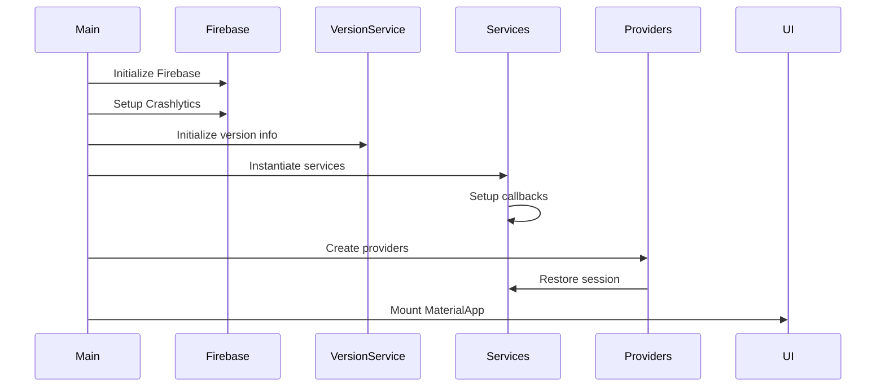

## Introduction

LogiScan is built using **Flutter** with a clean, layered architecture that promotes separation of concerns, testability, and maintainability. The application follows a feature-based organization with a shared core layer.

## Architectural Layers

The architecture is divided into three primary layers:

<CardGroup cols={3}>
  <Card title="Core Layer" icon="cube">
    Shared services, models, configuration, and utilities used across the entire app
  </Card>
  <Card title="Features Layer" icon="layer-group">
    Feature-specific code organized by domain (auth, scan, tracking, etc.)
  </Card>
  <Card title="Presentation Layer" icon="mobile">
    UI components, pages, and widgets that users interact with
  </Card>
</CardGroup>

## Directory Structure

The codebase follows a clear, hierarchical structure:

```
lib/
├── core/
│   ├── config/           # API configuration and endpoints
│   │   └── api_config.dart
│   ├── models/           # Shared data models
│   │   ├── api_response.dart
│   │   └── api_error.dart
│   ├── services/         # Core business services
│   │   ├── http_service.dart
│   │   ├── storage_service.dart
│   │   ├── secure_credentials_service.dart
│   │   ├── app_logger.dart
│   │   ├── version_service.dart
│   │   └── app_update_service.dart
│   ├── presentation/     # Shared UI components
│   │   ├── message_helper.dart
│   │   └── widgets/
│   │       └── loading_indicator.dart
│   └── theme/            # App-wide theming
│       └── app_theme.dart
├── features/
│   ├── auth/
│   │   ├── models/       # Authentication models
│   │   ├── services/     # Auth business logic
│   │   ├── providers/    # State management
│   │   └── presentation/ # Auth UI
│   └── scan/
│       ├── models/       # Scanning/measurement models
│       ├── services/     # Scan business logic
│       └── presentation/ # Scan UI
└── main.dart             # Application entry point
```

<Note>
Each feature module is self-contained with its own models, services, providers, and UI components.
</Note>

## Core Architectural Patterns

### 1. Dependency Injection

Services are instantiated at the app level and injected down through the widget tree using Provider:

```dart main.dart
class _LogiScanAppState extends State<LogiScanApp> {
  late final StorageService _storageService;
  late final HttpService _httpService;
  late final SecureCredentialsService _secureCredentialsService;
  late final AuthService _authService;
  late final MeasurementService _measurementService;

  @override
  void initState() {
    super.initState();
    _storageService = StorageService();
    _secureCredentialsService = SecureCredentialsService();
    _httpService = HttpService(
      baseUrl: ApiConfig.baseUrl,
      onSessionExpired: () {
        // Session expiration handling
      },
    );
    _authService = AuthService(
      _httpService, 
      _storageService, 
      _secureCredentialsService
    );
    _measurementService = MeasurementService(_httpService);

    _httpService.tokenRefreshCallback = () async {
      return await _authService.refreshTokenIfNeeded();
    };
  }
}
```

### 2. Provider Pattern for State Management

The app uses the **Provider** package for state management, with `ChangeNotifier` classes for reactive state:

```dart main.dart
return MultiProvider(
  providers: [
    ChangeNotifierProvider<AuthProvider>(
      create: (_) => AuthProvider(_authService),
    ),
    Provider<MeasurementService>(
      create: (_) => _measurementService,
    ),
  ],
  child: MaterialApp(
    debugShowCheckedModeBanner: false,
    title: 'LogiScan',
    theme: AppTheme.lightTheme,
    home: const AuthScreen(),
  ),
);
```

### 3. Service Layer Pattern

All business logic is encapsulated in service classes that are injected into providers or used directly:

- **HttpService**: Handles all HTTP communication
- **AuthService**: Manages authentication and token refresh
- **StorageService**: Persists data locally
- **MeasurementService**: Handles package scanning and measurement

### 4. Repository Pattern

Services act as repositories, abstracting data sources and providing a clean API:

```dart auth_service.dart
class AuthService {
  final HttpService _http;
  final StorageService _storage;
  final SecureCredentialsService _secureStorage;

  AuthService(this._http, this._storage, this._secureStorage) {
    _restoreToken();
  }

  Future<ApiResponse<LoginResponse>> login(LoginRequest request) async {
    final response = await _http.post<LoginResponse>(
      ApiEndpoints.login,
      request.toJson(),
      (json) => LoginResponse.fromJson(json),
    );

    if (response.isSuccessful && response.content?.token != null) {
      final token = response.content!.token!;
      _http.setToken(token);
      await _storage.setToken(token);
      await _storage.setLoginData(response.content!.toJson());
    }

    return response;
  }
}
```

## Key Design Principles

<AccordionGroup>
  <Accordion title="Separation of Concerns">
    Each layer has a distinct responsibility:
    - **Models**: Data structures only
    - **Services**: Business logic and data access
    - **Providers**: State management and UI logic
    - **Presentation**: UI components and user interaction
  </Accordion>

  <Accordion title="Single Responsibility">
    Each service has a focused purpose:
    - `HttpService` only handles HTTP communication
    - `StorageService` only manages local storage
    - `AuthService` only handles authentication
  </Accordion>

  <Accordion title="Dependency Inversion">
    High-level modules don't depend on low-level modules. Services are injected rather than instantiated directly:
    
    ```dart
    // Good: Service injected
    class AuthService {
      final HttpService _http;
      AuthService(this._http);
    }
    
    // Bad: Direct instantiation
    class AuthService {
      final _http = HttpService();
    }
    ```
  </Accordion>

  <Accordion title="Immutability">
    Models are immutable where possible, using `const` constructors and `final` fields to prevent accidental mutations.
  </Accordion>
</AccordionGroup>

## Error Handling Strategy

The app uses a consistent error handling approach:

1. **API errors** are wrapped in `ApiResponse<T>` with error codes
2. **Network errors** are caught and converted to user-friendly messages
3. **Auth errors** trigger automatic token refresh or logout
4. **Business errors** are displayed to users with context

```dart api_response.dart
class ApiResponse<T> {
  final bool isSuccessful;
  final String? message;        // Success message
  final String? messageDetail;  // Error detail
  final T? content;

  factory ApiResponse.error({
    String? messageDetail,
    T? content,
  }) {
    return ApiResponse(
      isSuccessful: false,
      messageDetail: messageDetail,
      content: content,
    );
  }

  String? get displayMessage => isSuccessful ? message : messageDetail;
}
```

## Initialization Flow

The application follows a specific initialization sequence:



<Steps>
  <Step title="Firebase Initialization">
    Firebase Core and Crashlytics are initialized first for error tracking
  </Step>
  
  <Step title="Version Service">
    App version information is loaded for API headers and update checks
  </Step>
  
  <Step title="Service Instantiation">
    Core services are created in dependency order
  </Step>
  
  <Step title="Provider Setup">
    State providers are created and session restoration begins
  </Step>
  
  <Step title="UI Mounting">
    The MaterialApp widget tree is built and rendered
  </Step>
</Steps>

## Configuration Management

Environment-specific configuration is centralized in `ApiConfig`:

```dart api_config.dart
class ApiConfig {
  static const String devBaseUrl = 'http://100.104.120.121:82';
  static const String prodBaseUrl = 'https://beehive.gbilogistics.net';
  
  static const bool isDevelopment = false;
  
  static String get baseUrl => isDevelopment ? devBaseUrl : prodBaseUrl;
  
  static const String version = '1.0';
  static String get apiPath => '/api/mobile/v$version';
  
  static String buildUrl(String endpoint) {
    return '$apiPath$endpoint';
  }
}
```

<Warning>
The `isDevelopment` flag controls which API environment the app connects to. Ensure this is set correctly before building for production.
</Warning>

## Performance Considerations

- **Lazy loading**: Services are only instantiated when needed
- **Caching**: Tokens and user data are cached locally to reduce API calls
- **Efficient rebuilds**: Provider pattern ensures only affected widgets rebuild
- **Image optimization**: Camera and scanner images are processed efficiently

## Next Steps

<CardGroup cols={2}>
  <Card title="Core Services" icon="server" href="/architecture/services">
    Learn about the core services and their responsibilities
  </Card>
  <Card title="State Management" icon="refresh" href="/architecture/state-management">
    Understand how state flows through the application
  </Card>
  <Card title="API Integration" icon="plug" href="/architecture/api-integration">
    Explore how LogiScan integrates with the backend API
  </Card>
</CardGroup>