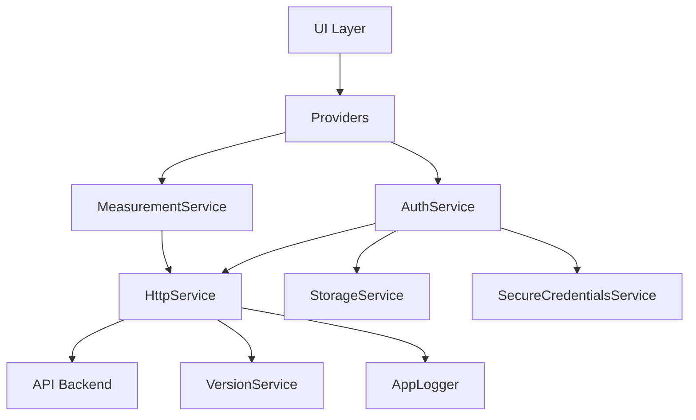

## Service Architecture

LogiScan's core services provide essential functionality that is shared across features. Each service has a specific responsibility and is designed to be loosely coupled and highly cohesive.

## HttpService

### Overview

The `HttpService` is the foundation of all API communication. It provides a consistent interface for making HTTP requests with built-in error handling, authentication, and token refresh.

### Key Responsibilities

<CardGroup cols={3}>
  <Card title="Request Handling" icon="paper-plane">
    Execute GET, POST, and DELETE requests with proper headers
  </Card>
  <Card title="Token Management" icon="key">
    Automatically attach and refresh authentication tokens
  </Card>
  <Card title="Error Processing" icon="triangle-exclamation">
    Convert HTTP errors to structured API errors
  </Card>
</CardGroup>

### Implementation Details

```dart http_service.dart
class HttpService {
  final String baseUrl;
  String? _token;

  Function()? onSessionExpired;
  Future<bool> Function()? onTokenRefreshNeeded;
  Function(VersionResponse)? onVersionCheckRequired;

  bool _isHandlingExpiredSession = false;

  HttpService({
    required this.baseUrl,
    this.onSessionExpired,
    this.onTokenRefreshNeeded,
  });

  void setToken(String? token) {
    if (token == null || token.trim().isEmpty) {
      _token = null;
      AppLogger.log('Token cleared', source: 'HttpService');
      return;
    }

    _token = token.startsWith('Bearer ') ? token : 'Bearer $token';
    AppLogger.log('Token set', source: 'HttpService', type: 'AUTH');
    _isHandlingExpiredSession = false;
  }

  Map<String, String> get _headers => {
    'Content-Type': 'application/json',
    'Accept': 'application/json',
    if (_token != null) 'Authorization': _token!,
    ...VersionService.instance.versionHeaders,
  };
}
```

### Token Refresh Mechanism

The service implements automatic token refresh when a 401 response is received:

```dart http_service.dart
if (response.statusCode == 401) {
  if (!_isHandlingExpiredSession && !suppressAuthHandling) {
    final refreshed = await _attemptTokenRefresh();
    if (refreshed) {
      // Retry the original request with the new token
      return await get<T>(
        path,
        fromJson,
        queryParams: queryParams,
        suppressAuthHandling: true,
      );
    }
  }

  await _handleSessionExpired(
    suppressAuthHandling: suppressAuthHandling,
    messageDetail: refreshedMessageDetail,
  );
}
```

<Note>
The `suppressAuthHandling` flag prevents infinite loops when retrying requests after token refresh.
</Note>

### Generic Request Methods

All request methods are generic and type-safe:

<Tabs>
  <Tab title="GET Request">
    ```dart http_service.dart
    Future<ApiResponse<T>> get<T>(
      String path,
      T Function(Map<String, dynamic> json) fromJson, {
      Map<String, dynamic>? queryParams,
      bool suppressAuthHandling = false,
    }) async {
      final uri = Uri.parse(baseUrl + path).replace(
        queryParameters:
            queryParams?.map((key, value) => MapEntry(key, value.toString())),
      );

      AppLogger.log('GET $uri Params: $queryParams', source: 'HttpService');

      final client = http.Client();
      final response = await client
          .get(uri, headers: _headers)
          .timeout(const Duration(seconds: 30));

      // Parse response and handle errors...
      Map<String, dynamic> json = jsonDecode(response.body);
      
      return ApiResponse(
        isSuccessful: true,
        message: json['message'],
        messageDetail: json['messageDetail'],
        content: fromJson(json),
      );
    }
    ```
  </Tab>
  
  <Tab title="POST Request">
    ```dart http_service.dart
    Future<ApiResponse<T>> post<T>(
      String path,
      dynamic data,
      T Function(Map<String, dynamic> json) fromJson, {
      bool suppressAuthHandling = false,
    }) async {
      if (!suppressAuthHandling && onTokenRefreshNeeded != null) {
        await onTokenRefreshNeeded!.call();
      }

      final client = http.Client();
      final response = await client
          .post(
            Uri.parse(baseUrl + path),
            headers: _headers,
            body: jsonEncode(data),
          )
          .timeout(const Duration(seconds: 30));

      // Handle response...
      Map<String, dynamic> json = jsonDecode(response.body);
      
      return ApiResponse(
        isSuccessful: true,
        message: json['message'],
        messageDetail: json['messageDetail'],
        content: fromJson(json),
      );
    }
    ```
  </Tab>
  
  <Tab title="DELETE Request">
    ```dart http_service.dart
    Future<ApiResponse<T>> delete<T>(
      String path,
      dynamic data,
      T Function(Map<String, dynamic> json) fromJson, {
      bool suppressAuthHandling = false,
    }) async {
      if (!suppressAuthHandling && onTokenRefreshNeeded != null) {
        await onTokenRefreshNeeded!.call();
      }

      final client = http.Client();
      final response = await client
          .delete(
            Uri.parse(baseUrl + path),
            headers: _headers,
            body: jsonEncode(data),
          )
          .timeout(const Duration(seconds: 30));

      // Handle response...
    }
    ```
  </Tab>
</Tabs>

### Version Header Injection

Every request automatically includes version headers:

```dart http_service.dart
Map<String, String> get _headers => {
  'Content-Type': 'application/json',
  'Accept': 'application/json',
  if (_token != null) 'Authorization': _token!,
  ...VersionService.instance.versionHeaders,  // Includes X-App-Version, X-App-Build, etc.
};
```

---

## StorageService

### Overview

The `StorageService` provides persistent storage for non-sensitive data using SharedPreferences.

### Key Operations

```dart storage_service.dart
class StorageService {
  final _prefs = SharedPreferences.getInstance();

  static const _tokenKey = 'auth_token';
  static const _tokenExpiryKey = 'auth_token_expiry';
  static const _loginDataKey = 'auth_login_data';
  static const _sessionKey = 'session_active';

  Future<String?> getToken() async {
    try {
      final prefs = await _prefs;
      return prefs.getString(_tokenKey);
    } on MissingPluginException {
      return null;
    }
  }

  Future<void> setTokenWithExpiry(String token, DateTime expiresAt) async {
    try {
      final prefs = await _prefs;
      await prefs.setString(_tokenKey, token);
      await prefs.setString(_tokenExpiryKey, expiresAt.toIso8601String());
    } on MissingPluginException {
      // Ignore in environments without plugin support
    }
  }

  Future<TokenData?> getTokenData() async {
    try {
      final prefs = await _prefs;
      final token = await getToken();
      final expiryStr = prefs.getString(_tokenExpiryKey);
      if (token == null || expiryStr == null) return null;
      return TokenData(
        token: token,
        expiresAt: DateTime.parse(expiryStr),
      );
    } on MissingPluginException {
      return null;
    }
  }
}
```

<Warning>
The service gracefully handles `MissingPluginException` for environments where SharedPreferences isn't available (e.g., during hot restart).
</Warning>

### Session Management

```dart storage_service.dart
Future<void> setLoginData(Map<String, dynamic> loginData) async {
  final prefs = await _prefs;
  await Future.wait([
    prefs.setString(_loginDataKey, jsonEncode(loginData)),
    prefs.setBool(_sessionKey, true),
  ]);
}

Future<void> clearSession() async {
  final prefs = await _prefs;
  await Future.wait([
    prefs.remove(_tokenKey),
    prefs.remove(_tokenExpiryKey),
    prefs.remove(_loginDataKey),
    prefs.remove(_sessionKey),
  ]);
}
```

---

## SecureCredentialsService

### Overview

Handles secure storage of sensitive credentials using FlutterSecureStorage.

### Implementation

```dart secure_credentials_service.dart
class SecureCredentialsService {
  static const _storage = FlutterSecureStorage();

  static const _keyUsername = 'username';
  static const _keyPassword = 'password';

  Future<void> saveCredentials(String username, String password) async {
    try {
      await _storage.write(key: _keyUsername, value: username);
      await _storage.write(key: _keyPassword, value: password);
    } on MissingPluginException {
      // In platforms without plugin, credentials are not persisted
    }
  }

  Future<Map<String, String?>> getCredentials() async {
    try {
      final username = await _storage.read(key: _keyUsername);
      final password = await _storage.read(key: _keyPassword);

      return {
        'username': username,
        'password': password,
      };
    } on MissingPluginException {
      return {'username': null, 'password': null};
    }
  }

  Future<void> clearCredentials() async {
    try {
      await _storage.delete(key: _keyUsername);
      await _storage.delete(key: _keyPassword);
    } on MissingPluginException {
      // No-op
    }
  }
}
```

<Note>
Credentials are stored in the device's secure storage (Keychain on iOS, KeyStore on Android).
</Note>

---

## AuthService

### Overview

Orchestrates authentication flows, token management, and session restoration.

### Dependencies

```dart auth_service.dart
class AuthService {
  final HttpService _http;
  final StorageService _storage;
  final SecureCredentialsService _secureStorage;

  AuthService(this._http, this._storage, this._secureStorage) {
    _restoreToken();
  }
}
```

### Login Flow

```dart auth_service.dart
Future<ApiResponse<LoginResponse>> login(LoginRequest request) async {
  try {
    final response = await _http.post<LoginResponse>(
      ApiEndpoints.login,
      request.toJson(),
      (json) => LoginResponse.fromJson(json),
    );

    if (response.isSuccessful && response.content?.token != null) {
      final token = response.content!.token!;
      final loginData = response.content!;
      _http.setToken(token);
      await _storage.setToken(token);
      await _storage.setLoginData(loginData.toJson());
    }

    return response;
  } catch (_) {
    return ApiResponse.error(
      messageDetail: null,
      content: LoginResponse.empty(),
    );
  }
}
```

### Session Restoration

```dart auth_service.dart
Future<LoginResponse?> restoreSession() async {
  final hasSession = await _storage.hasActiveSession();
  final token = await _storage.getToken();
  final loginData = await _storage.getLoginData();

  if (hasSession && token != null) {
    _http.setToken(token);
    if (loginData != null) {
      return LoginResponse.fromJson(loginData);
    }
  }
  return null;
}
```

### Token Refresh Logic

```dart auth_service.dart
Future<bool> refreshTokenIfNeeded() async {
  if (_isRefreshing) return true;

  try {
    _isRefreshing = true;
    final tokenData = await _storage.getTokenData();
    if (tokenData == null) return false;

    final expiresAt = tokenData.expiresAt;
    final now = DateTime.now();

    // Check if token is still valid for more than 30 minutes
    if (expiresAt.difference(now) > ApiConfig.refreshTokenBeforeExpiry) {
      return true;
    }

    // Try to refresh using saved credentials
    final saved = await _secureStorage.getCredentials();
    final username = saved['username'];
    final password = saved['password'];

    if (username != null && password != null) {
      final loginRequest = LoginRequest(username: username, password: password);
      final loginResponse = await login(loginRequest);
      return loginResponse.isSuccessful;
    }

    return false;
  } finally {
    _isRefreshing = false;
  }
}
```

<AccordionGroup>
  <Accordion title="Why store credentials?">
    Credentials are stored securely to enable automatic re-authentication when tokens expire, providing a seamless user experience without requiring manual re-login.
  </Accordion>
  
  <Accordion title="Token expiry handling">
    Tokens are proactively refreshed 30 minutes before expiration (configured in `ApiConfig.refreshTokenBeforeExpiry`) to prevent authentication failures during active use.
  </Accordion>
</AccordionGroup>

---

## MeasurementService

### Overview

Handles all package scanning, measurement processing, and tracking operations.

### Key Operations

```dart measurement_service.dart
class MeasurementService {
  final HttpService _http;

  MeasurementService(this._http);

  Future<ApiResponse<ProcessMeasurementDataResponse>>
      processMeasurementData(ProcessMeasurementDataRequest request) async {
    try {
      final response = await _http.post<ProcessMeasurementDataResponse>(
        ApiEndpoints.processMeasurement,
        request.toJson(),
        (json) => ProcessMeasurementDataResponse.fromJson(json),
      );

      if (!response.isSuccessful) {
        return ApiResponse.error(
          messageDetail: response.messageDetail,
          content: ProcessMeasurementDataResponse.empty(),
        );
      }

      return response;
    } catch (_) {
      return ApiResponse.error(
        messageDetail: null,
        content: ProcessMeasurementDataResponse.empty(),
      );
    }
  }
}
```

### Service Methods

<CardGroup cols={2}>
  <Card title="processMeasurementData" icon="ruler">
    Process package measurements from camera/scanner
  </Card>
  <Card title="registerPackage" icon="box">
    Register a new package in the system
  </Card>
  <Card title="verifyTrackingNumber" icon="check">
    Verify tracking number validity
  </Card>
  <Card title="getPackageTrackingDetails" icon="magnifying-glass">
    Retrieve package tracking information
  </Card>
  <Card title="registerPackageImages" icon="camera">
    Upload package images
  </Card>
  <Card title="deleteTrackingPackageImages" icon="trash">
    Remove package images
  </Card>
</CardGroup>

---

## VersionService

### Overview

Manages app version information and provides headers for API requests.

```dart version_service.dart
class VersionService {
  static VersionService? _instance;
  static VersionService get instance => _instance ??= VersionService._();

  PackageInfo? _packageInfo;

  Future<void> initialize() async {
    try {
      _packageInfo = await PackageInfo.fromPlatform();
      debugPrint('VersionService initialized: $fullVersion');
    } catch (e) {
      _packageInfo = PackageInfo(
        version: '1.0.0',
        buildNumber: '8',
        appName: 'LogiScan',
        packageName: 'com.gbi_logistics.logiscan',
      );
    }
  }

  Map<String, String> get versionHeaders => {
    'X-App-Version': version,
    'X-App-Build': buildNumber,
    'X-App-Platform': platform,
    'X-Client-Type': 'mobile-app',
  };
}
```

---

## AppLogger

### Overview

Centralized logging service for debugging and monitoring.

```dart app_logger.dart
class AppLogger {
  static void log(
    String message, {
    String? source,
    Object? error,
    StackTrace? stackTrace,
    String type = 'INFO',
  }) {
    final logMessage = '''
----------------------------------------
[$type] ${source != null ? '[$source]' : ''}: $message
${error != null ? '\nError: $error' : ''}
${stackTrace != null ? '\nStack: \n$stackTrace' : ''}
----------------------------------------''';

    debugPrint(logMessage);
  }

  static void apiCall(String endpoint, {String? method, String? body}) {
    log(
      'API Call: ${method ?? 'GET'} $endpoint${body != null ? '\nBody: $body' : ''}',
      source: 'API',
    );
  }

  static void apiResponse(String endpoint, {int? statusCode, String? body}) {
    log(
      'API Response: $endpoint\nStatus: ${statusCode ?? 'Unknown'}\nBody: ${body ?? 'No body'}',
      source: 'API',
    );
  }
}
```

## Service Interaction Diagram



## Best Practices

<Check>Always inject services through constructors for testability</Check>
<Check>Use the AppLogger for all logging instead of print statements</Check>
<Check>Handle MissingPluginException gracefully in storage services</Check>
<Check>Implement proper error handling in all service methods</Check>
<Check>Keep services focused on a single responsibility</Check>

## Next Steps

<CardGroup cols={2}>
  <Card title="State Management" icon="refresh" href="/architecture/state-management">
    Learn how providers manage and propagate state
  </Card>
  <Card title="API Integration" icon="plug" href="/architecture/api-integration">
    Explore API communication patterns
  </Card>
</CardGroup>