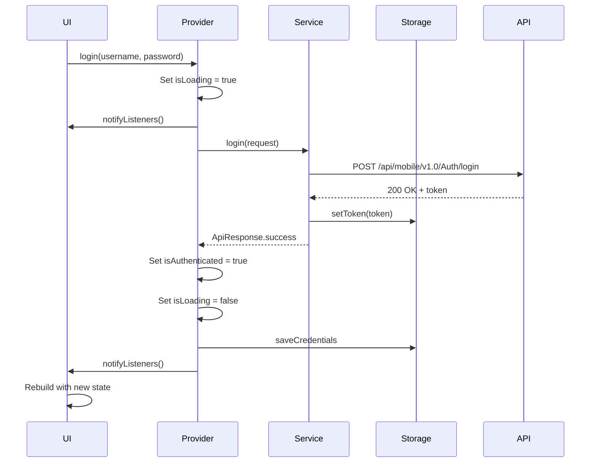

## Overview

LogiScan uses the **Provider** package for state management, implementing the ChangeNotifier pattern for reactive UI updates. This approach provides a clean separation between business logic and UI while ensuring efficient widget rebuilds.

## Provider Architecture

### Setup in Main App

Providers are configured at the root level using `MultiProvider`:

```dart main.dart
return MultiProvider(
  providers: [
    ChangeNotifierProvider<AuthProvider>(
      create: (_) => AuthProvider(_authService),
    ),
    Provider<MeasurementService>(
      create: (_) => _measurementService,
    ),
  ],
  child: MaterialApp(
    debugShowCheckedModeBanner: false,
    title: 'LogiScan',
    theme: AppTheme.lightTheme,
    home: const AuthScreen(),
  ),
);
```

<Note>
**ChangeNotifierProvider** is used for reactive state (like AuthProvider), while **Provider** is used for services that don't manage state (like MeasurementService).
</Note>

## AuthProvider

### Overview

The `AuthProvider` manages authentication state and exposes reactive properties to the UI.

### State Properties

```dart auth_provider.dart
class AuthProvider extends ChangeNotifier {
  final AuthService _authService;
  final SecureCredentialsService _secureStorage = SecureCredentialsService();

  bool _isLoading = false;
  String? _error;
  LoginResponse? _loginData;
  bool _isAuthenticated = false;

  // Getters expose state to the UI
  bool get isLoading => _isLoading;
  String? get error => _error;
  bool get isAuthenticated => _isAuthenticated;
  LoginResponse? get loginData => _loginData;
}
```

<CardGroup cols={2}>
  <Card title="isLoading" icon="spinner">
    Indicates whether an authentication operation is in progress
  </Card>
  <Card title="isAuthenticated" icon="shield-check">
    Whether the user is currently authenticated
  </Card>
  <Card title="error" icon="triangle-exclamation">
    The current error message, if any
  </Card>
  <Card title="loginData" icon="user">
    The authenticated user's data and permissions
  </Card>
</CardGroup>

### Initialization and Session Restoration

The provider automatically attempts to restore the user's session on startup:

```dart auth_provider.dart
AuthProvider(this._authService) {
  _restoreSession();
}

Future<void> _restoreSession() async {
  try {
    final loginData = await _authService.restoreSession();
    if (loginData != null) {
      _loginData = loginData;
      _isAuthenticated = true;
      notifyListeners();
    } else {
      // Try automatic login with saved credentials
      final saved = await _secureStorage.getCredentials();
      final username = saved['username'];
      final password = saved['password'];
      if (username != null && password != null) {
        await login(username, password);
      }
    }
  } catch (e) {
    debugPrint('Error restoring session: $e');
    await logout();
  }
}
```

<Steps>
  <Step title="Check for Existing Session">
    First, attempt to restore session from stored token and login data
  </Step>
  
  <Step title="Automatic Re-authentication">
    If no valid session exists, try to login automatically using securely stored credentials
  </Step>
  
  <Step title="Notify Listeners">
    Update the UI once the session state is determined
  </Step>
</Steps>

### Login Flow

The login method orchestrates the authentication process and updates state:

```dart auth_provider.dart
Future<bool> login(String username, String password) async {
  AppLogger.log('Attempting login', source: 'AuthProvider');
  try {
    _isLoading = true;
    _error = null;
    notifyListeners();  // Update UI to show loading state

    final request = LoginRequest(username: username, password: password);
    final response = await _authService.login(request);

    if (response.isSuccessful && response.content != null) {
      _loginData = response.content;
      _isAuthenticated = true;
      _error = null;

      // Save credentials for automatic re-authentication
      await _secureStorage.saveCredentials(username, password);
      AppLogger.log('Login successful', source: 'AuthProvider', type: 'SUCCESS');
      return true;
    } else {
      _error = response.messageDetail ?? response.message;
      AppLogger.error('Login failed', error: _error ?? 'No message', source: 'AuthProvider');
      return false;
    }
  } catch (e, stackTrace) {
    _error = e.toString();
    AppLogger.error('Login error', error: e, stackTrace: stackTrace, source: 'AuthProvider');
    return false;
  } finally {
    _isLoading = false;
    notifyListeners();  // Update UI with final state
  }
}
```

<Warning>
**Important**: `notifyListeners()` is called at strategic points to ensure the UI updates appropriately. It's called when loading starts, and again in the `finally` block to ensure it's called regardless of success or failure.
</Warning>

### Logout Flow

```dart auth_provider.dart
Future<void> logout() async {
  try {
    await _authService.logout();
  } finally {
    await _secureStorage.clearCredentials();
    _isAuthenticated = false;
    _loginData = null;
    _error = null;
    notifyListeners();
  }
}
```

### Error Management

```dart auth_provider.dart
void clearError() {
  _error = null;
  notifyListeners();
}
```

## Consuming State in the UI

### Using Consumer

The `Consumer` widget rebuilds when the provider's state changes:

```dart example_page.dart
Consumer<AuthProvider>(
  builder: (context, authProvider, child) {
    if (authProvider.isLoading) {
      return const CircularProgressIndicator();
    }

    if (authProvider.error != null) {
      return Text('Error: ${authProvider.error}');
    }

    if (!authProvider.isAuthenticated) {
      return const LoginForm();
    }

    return HomePage(user: authProvider.loginData);
  },
)
```

### Using Provider.of

For accessing state without rebuilding:

```dart example_page.dart
final authProvider = Provider.of<AuthProvider>(context, listen: false);
await authProvider.login(username, password);
```

<Accordion title="When to use listen: false">
  Use `listen: false` when you need to access the provider to call methods but don't want the widget to rebuild when the provider's state changes. This is common in event handlers like button presses.
</Accordion>

### Using context.read and context.watch

Modern Provider syntax offers convenient extensions:

<Tabs>
  <Tab title="context.watch (rebuilds)">
    ```dart
    Widget build(BuildContext context) {
      final authProvider = context.watch<AuthProvider>();
      
      return Text('User: ${authProvider.loginData?.username}');
    }
    ```
    
    Equivalent to `Provider.of<T>(context, listen: true)`
  </Tab>
  
  <Tab title="context.read (no rebuild)">
    ```dart
    void _handleLogin() {
      final authProvider = context.read<AuthProvider>();
      authProvider.login(username, password);
    }
    ```
    
    Equivalent to `Provider.of<T>(context, listen: false)`
  </Tab>
  
  <Tab title="context.select (selective rebuild)">
    ```dart
    Widget build(BuildContext context) {
      final isAuthenticated = context.select<AuthProvider, bool>(
        (provider) => provider.isAuthenticated,
      );
      
      return Text(isAuthenticated ? 'Logged in' : 'Logged out');
    }
    ```
    
    Only rebuilds when the selected property changes
  </Tab>
</Tabs>

## State Flow Diagram



## Service Providers vs State Providers

### State Providers (ChangeNotifierProvider)

Used for reactive state that the UI needs to respond to:

```dart
ChangeNotifierProvider<AuthProvider>(
  create: (_) => AuthProvider(_authService),
)
```

**Characteristics:**
- Extends `ChangeNotifier`
- Calls `notifyListeners()` when state changes
- UI automatically rebuilds on state changes
- Used for: authentication state, form state, UI state

### Service Providers (Provider)

Used for services that don't manage state:

```dart
Provider<MeasurementService>(
  create: (_) => _measurementService,
)
```

**Characteristics:**
- Plain Dart class
- No reactive updates
- UI accesses methods but doesn't rebuild
- Used for: API services, utility services, repositories

## Best Practices

<AccordionGroup>
  <Accordion title="Keep Providers Focused">
    Each provider should manage a specific domain of state. Don't create a single "AppProvider" that manages everything.
    
    ```dart
    // Good: Focused providers
    - AuthProvider (authentication state)
    - ScanProvider (scanning state)
    - SettingsProvider (app settings)
    
    // Bad: Monolithic provider
    - AppProvider (everything)
    ```
  </Accordion>
  
  <Accordion title="Use Getters for Computed State">
    Derive state from existing properties rather than storing redundant data:
    
    ```dart
    class AuthProvider extends ChangeNotifier {
      LoginResponse? _loginData;
      
      // Good: Computed property
      bool get isAuthenticated => _loginData != null;
      
      // Bad: Redundant state
      // bool _isAuthenticated;
    }
    ```
  </Accordion>
  
  <Accordion title="Minimize notifyListeners Calls">
    Call `notifyListeners()` only after all state updates are complete to avoid multiple rebuilds:
    
    ```dart
    // Good: Single notification
    _isLoading = false;
    _error = null;
    _loginData = data;
    notifyListeners();
    
    // Bad: Multiple notifications
    _isLoading = false;
    notifyListeners();
    _error = null;
    notifyListeners();
    _loginData = data;
    notifyListeners();
    ```
  </Accordion>
  
  <Accordion title="Use context.select for Granular Updates">
    When a widget only needs specific properties, use `context.select` to prevent unnecessary rebuilds:
    
    ```dart
    // Only rebuilds when isLoading changes
    final isLoading = context.select<AuthProvider, bool>(
      (provider) => provider.isLoading,
    );
    ```
  </Accordion>
  
  <Accordion title="Handle Async Operations Properly">
    Always use try-catch-finally pattern for async operations:
    
    ```dart
    Future<void> someAsyncOperation() async {
      try {
        _isLoading = true;
        notifyListeners();
        
        // Async work here
        
      } catch (e) {
        _error = e.toString();
      } finally {
        _isLoading = false;
        notifyListeners();
      }
    }
    ```
  </Accordion>
</AccordionGroup>

## Common Patterns

### Loading States

```dart
if (authProvider.isLoading) {
  return const Center(child: CircularProgressIndicator());
}
```

### Error Display

```dart
if (authProvider.error != null) {
  return ErrorWidget(
    message: authProvider.error!,
    onRetry: () => authProvider.clearError(),
  );
}
```

### Conditional Navigation

```dart
if (authProvider.isAuthenticated) {
  Navigator.pushReplacement(
    context,
    MaterialPageRoute(builder: (_) => const HomePage()),
  );
}
```

### Form Submission

```dart
ElevatedButton(
  onPressed: authProvider.isLoading
      ? null  // Disable while loading
      : () async {
          final success = await context.read<AuthProvider>().login(
            _usernameController.text,
            _passwordController.text,
          );
          
          if (success && mounted) {
            Navigator.pushReplacement(
              context,
              MaterialPageRoute(builder: (_) => const HomePage()),
            );
          }
        },
  child: Text(authProvider.isLoading ? 'Loading...' : 'Login'),
)
```

## Testing State Management

### Mocking Providers in Tests

```dart
final mockAuthService = MockAuthService();
final authProvider = AuthProvider(mockAuthService);

// Test login success
when(mockAuthService.login(any))
    .thenAnswer((_) async => ApiResponse.success(
          content: LoginResponse(token: 'test_token'),
        ));

await authProvider.login('user', 'pass');

expect(authProvider.isAuthenticated, true);
expect(authProvider.error, null);
```

## State Persistence

Critical state is persisted across app restarts:

<CardGroup cols={2}>
  <Card title="Authentication Token" icon="key">
    Stored in SharedPreferences via StorageService
  </Card>
  <Card title="User Credentials" icon="lock">
    Stored in FlutterSecureStorage for auto-login
  </Card>
  <Card title="Login Data" icon="user-circle">
    Stored as JSON in SharedPreferences
  </Card>
  <Card title="Session Status" icon="clock">
    Boolean flag indicating active session
  </Card>
</CardGroup>

## Performance Optimization

### Selective Rebuilds with Selector

```dart
Selector<AuthProvider, String?>(
  selector: (context, provider) => provider.error,
  builder: (context, error, child) {
    if (error == null) return const SizedBox.shrink();
    return ErrorBanner(message: error);
  },
)
```

### Avoiding Provider in Build Method

```dart
// Bad: Creates new instance every build
Widget build(BuildContext context) {
  return Provider(
    create: (_) => SomeService(),
    child: ChildWidget(),
  );
}

// Good: Provider at app level or use existing provider
Widget build(BuildContext context) {
  final service = context.read<SomeService>();
  return ChildWidget(service: service);
}
```

## Next Steps

<CardGroup cols={2}>
  <Card title="API Integration" icon="plug" href="/architecture/api-integration">
    Learn how state management integrates with API calls
  </Card>
  <Card title="Core Services" icon="server" href="/architecture/services">
    Understand the services that providers depend on
  </Card>
</CardGroup>